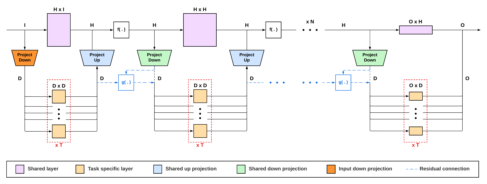

# Projected Task-Specific Layers for Multi-Task Reinforcement Learning
[paper](TODO) | [mtrl repo](https://github.com/facebookresearch/mtrl) | [mtrl docs](https://mtrl.readthedocs.io/en/latest/index.html)

In proceedings - IEEE ICRA 2024

**Authors:** Josselin Somerville Roberts, Julia Di

## Abstract 
Multi-task learning is a very challenging problem in reinforcement learning and yet it is essential in order to build robots capable of performing tasks in a real-world setting. One of the challenges of multi-task learning is learning how to generalize from one task to another. Another challenge is to design a policy such that when learning simultaneously several tasks, improving in one task does not deteriorate too much other tasks' performances. In this paper, we will focus in the latter by introducing our new architecture, Projected Task-Specific Layers (PTSL), that introduces the notion of a common policy with dense task-specific corrections through task-specific layers. We then show that our model outperforms the state of the art on the MT-10 benchmark of meta world consisting of 10 goal-conditioned tasks for a sawyer arm.

## Table of contents
* [Installation](#installation)
* [Method](#method)
* [Recreate the results from the paper](#recreate)

## Installation
We recommend using `conda` to install this as we were not able to install the package using facebook's isntructions. Instead we provide a custom `environment.yml` to install it with `conda`.

**If you are on an AWS EC2 instance, you can run our script: `aws_setup.sh` that should handle everything for you.**

Here are the step you will have to follow *(from this directory)* to install the repo:

* Instal Mujoco (see below). If the website is down *(which happenned in the past)* you can instead unzip the provided `.mujoco.zip` of this repo and place it in your home directory. Otherwise, run the following commands:
```bash
# Install Mujoco
pwd=`pwd` # Save current path
cd /home/ubuntu
mkdir .mujoco
cd .mujoco
wget https://www.roboti.us/file/mjkey.txt # Key
wget https://www.roboti.us/download/mujoco200_linux.zip # Mujoco 200
yes y | sudo apt-get install unzip
unzip mujoco200_linux.zip
mv mujoco200_linux mujoco200
rm -r -f mujoco200_linux.zip
wget https://mujoco.org/download/mujoco210-linux-x86_64.tar.gz # Mujoco 210 (Not needed)
tar -xvf mujoco210-linux-x86_64.tar.gz
rm -r -f mujoco210-linux-x86_64.tar.gz
cd $pwd
```

* You should then add the following lines to your `~/.bashrc` (or `~/.zshrc` if you use `zsh`) toc omplete the installation:
```bash
echo 'export LD_LIBRARY_PATH=$LD_LIBRARY_PATH:~/.mujoco/mujoco200/bin' >> ~/.bashrc
echo 'export LD_LIBRARY_PATH=$LD_LIBRARY_PATH:/usr/lib/nvidia' >> ~/.bashrc
source ~/.bashrc
```

* Create the conda environment `mtrl` and activate it. *This contains most necessary packages for the project except a few one that you will have to install manually (see below)*. This may take up some time.
```bash
# Create conda env and activate it
conda env create -f environment.yml
conda init bash
source ~/.bashrc
conda activate mtrl
```

* Finish installing mujoco, this will use `apt` to install some packages.
```bash
# Finish installing mujoco
yes y | sudo apt update
yes y | sudo apt-get install patchelf
yes y | sudo apt-get install libglew-dev
yes y | sudo apt install libosmesa6-dev libgl1-mesa-glx libglfw3

# Finish mujoco installs
yes y | pip install "cython<3"
yes y | pip install lockfile
yes y | pip install gym==0.21.0
# You can try to install mujoco-py version 2.0.2.13
# but this often generates this error:
# mujoco_py/cymj.pyx:92:23: Cannot assign type 'void (const char *) except * nogil' to 'void (*)(const char *) noexcept nogil'. Exception values are incompatible. Suggest adding 'noexcept' to type 'void (const char *) except * nogil'.
# So instead of this:
# yes y | pip install mujoco-py==2.0.2.13
# We advise to downgrade to version 2.0.2.5:
yes y | pip install mujoco-py==2.0.2.5
yes y | pip install scipy==1.9.1
yes y | pip install protobuf==3.20.0
```
At this point, if you run into issues with the installation of `gym==0.21.0` or `mujoco-py`, try running the following commands:
```bash
# Install GCC 7
sudo add-apt-repository ppa:jonathonf/gcc
sudo apt-get update
sudo apt install gcc-7

sudo apt-get install patchelf
sudo apt-get install libglu1-mesa-dev mesa-common-dev
```

* Finally install the last dependencies:
```bash
# Additional installs (metaworld, mtenv)
yes y | pip install git+https://github.com/Farama-Foundation/Metaworld.git@af8417bfc82a3e249b4b02156518d775f29eb28
yes y | pip install "mtenv[metaworld]"
yes y | pip install git+https://github.com/JosselinSomervilleRoberts/JossPythonToolbox.git
yes y | pip install wandb
```

You can check your installation by running:
```bash
PYTHONPATH=. python3 -u main.py setup=metaworld agent=state_sac env=metaworld-mt10 agent.multitask.num_envs=10 agent.multitask.should_use_disentangled_alpha=True
```
You should see something like this (after a few minutes):
```
| train | E: 5270 | S: 790500 | D: 2.7 s | Su: 0.6000 | BR: 1.1579 | ALOSS: -129.9481 | CLOSS: 48.9331 | R_0: 487.5569 | R_1: 8.9984 | R_2: 158.9726 | R_3: 186.7860 | R_4: 17.6790 | R_5: 179.2791 | R_6: 224.1127 | R_7: 119.9955 | R_8: 100.4628 | R_9: 148.0436 | Su_0: 1.0000 | Su_1: 0.0000 | Su_2: 1.0000 | Su_3: 1.0000 | Su_4: 0.0000 | Su_5: 1.0000 | Su_6: 1.0000 | Su_7: 0.0000 | Su_8: 0.0000 | Su_9: 1.0000 | ENV_0: 0 | ENV_1: 1 | ENV_2: 2 | ENV_3: 3 | ENV_4: 4 | ENV_5: 5 | ENV_6: 6 | ENV_7: 7 | ENV_8: 8 | ENV_9: 9
| train | E: 5271 | S: 790650 | D: 2.7 s | Su: 0.7000 | BR: 1.1659 | ALOSS: -131.8787 | CLOSS: 45.3631 | R_0: 458.9632 | R_1: 294.8278 | R_2: 88.5741 | R_3: 80.9546 | R_4: 328.5237 | R_5: 0.4047 | R_6: 162.7022 | R_7: 227.9077 | R_8: 79.3807 | R_9: 151.6023 | Su_0: 1.0000 | Su_1: 1.0000 | Su_2: 1.0000 | Su_3: 1.0000 | Su_4: 1.0000 | Su_5: 0.0000 | Su_6: 1.0000 | Su_7: 0.0000 | Su_8: 0.0000 | Su_9: 1.0000 | ENV_0: 0 | ENV_1: 1 | ENV_2: 2 | ENV_3: 3 | ENV_4: 4 | ENV_5: 5 | ENV_6: 6 | ENV_7: 7 | ENV_8: 8 | ENV_9: 9
```

it is very likely that when running the previous command, you will get an error like this:
```
Maximum path length allowed by the benchmark has been exceeded
```
This is a `mujoco` check that we can disable. To do this, simply go to `~/anaconda3/envs/mtrl/lib/python3.8/site-packages/metaworld/envs/mujoco/mujoco_env.py` and comment the lines 107 and 108:
```python
if getattr(self, 'curr_path_length', 0) > self.max_path_length:
  raise ValueError('Maximum path length allowed by the benchmark has been exceeded')
```


## Method

PTSL (Projected Task-Specific Layers) is a network architecture for multi-tal learning. It is made of a shared backbone and low-rank task-specific layers (See Figure below for an illustration of PTSL).
The backbone is a linear layer that is shared between all tasks. The task-specific layers are linear layers that are specific to each task.




## <a name="recreate"></a>Recreate the results from the paper

In this section we describe the exact commands to run the same experiments as us and recreate the exact same results. All commands should be run inside the `mtrl` environment from the root of the repo *(Results are seeded from 1 to $n$ if you are running $n$ experiments)*.

### MT-10 for 200K steps

You chan check out our Wandb run [here](https://wandb.ai/single-shot-robot/PTSL_MTRL10-200K?workspace=user-josselin).

* **MT-SAC**:
```bash
PYTHONPATH=. python3 -u main.py setup=metaworld env=metaworld-mt10 agent=state_sac \
agent.actor.hidden_dim=400 agent.actor.num_layers=3 agent.multitask.num_envs=10 \
experiment.num_eval_episodes=10 experiment.num_train_steps=200000 setup.seed_ref=1 \
setup.num_seeds=10 setup.name=SAC replay_buffer.batch_size=1280 \
agent.encoder.type_to_select=identity agent.multitask.num_envs=10 \
agent.multitask.should_use_disentangled_alpha=True agent.multitask.should_use_multi_head_policy=False \
agent.multitask.actor_cfg.should_condition_model_on_task_info=False \
agent.multitask.actor_cfg.should_condition_encoder_on_task_info=True \
agent.multitask.actor_cfg.should_concatenate_task_info_with_encoder=True
```

* **Soft Modularization**:
```bash
PYTHONPATH=. python3 -u main.py setup=metaworld env=metaworld-mt10 agent=state_sac \
experiment.num_eval_episodes=10 experiment.num_train_steps=200000 setup.seed_ref=1 \
setup.num_seeds=10 setup.name=soft_modularization replay_buffer.batch_size=1280 \
agent.multitask.num_envs=10 agent.multitask.should_use_disentangled_alpha=True \
agent.multitask.should_use_task_encoder=True agent.encoder.type_to_select=feedforward \
agent.multitask.actor_cfg.should_condition_model_on_task_info=True \
agent.multitask.actor_cfg.should_condition_encoder_on_task_info=False \
agent.multitask.actor_cfg.should_concatenate_task_info_with_encoder=False \
agent.multitask.actor_cfg.moe_cfg.should_use=True \
agent.multitask.actor_cfg.moe_cfg.mode=soft_modularization \
agent.multitask.should_use_multi_head_policy=False \
agent.encoder.feedforward.hidden_dim=50 agent.encoder.feedforward.num_layers=2 \
agent.encoder.feedforward.feature_dim=50 agent.actor.num_layers=4 \
agent.multitask.task_encoder_cfg.model_cfg.pretrained_embedding_cfg.should_use=False
```

* **CARE**:
```bash
PYTHONPATH=. python3 -u main.py setup=metaworld env=metaworld-mt10 agent=state_sac \
agent.actor.hidden_dim=400 agent.actor.num_layers=3 agent.multitask.num_envs=10 \
experiment.num_eval_episodes=10 experiment.num_train_steps=200000 setup.seed_ref=1 \
setup.num_seeds=10 setup.name=CARE replay_buffer.batch_size=1280 agent.encoder.type_to_select=moe \
agent.encoder.moe.task_id_to_encoder_id_cfg.mode=attention agent.encoder.moe.num_experts=4 \
agent.multitask.num_envs=10 agent.multitask.should_use_disentangled_alpha=True \
agent.multitask.should_use_task_encoder=True agent.multitask.should_use_multi_head_policy=False \
agent.multitask.task_encoder_cfg.model_cfg.pretrained_embedding_cfg.should_use=True
```

* **CARE - PTSL** (Same number of parameters as CARE):
```bash
PYTHONPATH=. python3 -u main.py setup=metaworld env=metaworld-mt10 agent=state_sac \
agent.actor.hidden_dim=326 agent.actor.num_layers=3 experiment.num_eval_episodes=10 \
experiment.num_train_steps=200000 setup.seed_ref=1 setup.num_seeds=10 \
setup.name=PAL_shared_3_hidden replay_buffer.batch_size=1280 agent.encoder.type_to_select=moe \
agent.encoder.moe.task_id_to_encoder_id_cfg.mode=attention agent.encoder.moe.num_experts=4 \
agent.multitask.num_envs=10 agent.multitask.should_use_disentangled_alpha=True \
agent.multitask.should_use_task_encoder=True agent.multitask.should_use_multi_head_policy=False \
agent.multitask.task_encoder_cfg.model_cfg.pretrained_embedding_cfg.should_use=True \
agent.multitask.should_use_pal=True agent.multitask.pal_cfg.pal_dim=50 \
agent.multitask.pal_cfg.shared_projection=True agent.multitask.pal_cfg.residual_mode=none
```

* **CARE - PTSL** (2 hidden layers):
```bash
PYTHONPATH=. python3 -u main.py setup=metaworld env=metaworld-mt10 agent=state_sac \
agent.actor.hidden_dim=400 agent.actor.num_layers=2 experiment.num_eval_episodes=10 \
experiment.num_train_steps=200000 setup.seed_ref=1 setup.num_seeds=10 \
setup.name=PAL_shared_2_hidden replay_buffer.batch_size=1280 agent.encoder.type_to_select=moe \
agent.encoder.moe.task_id_to_encoder_id_cfg.mode=attention agent.encoder.moe.num_experts=4 \
agent.multitask.num_envs=10 agent.multitask.should_use_disentangled_alpha=True \
agent.multitask.should_use_task_encoder=True agent.multitask.should_use_multi_head_policy=False \
agent.multitask.task_encoder_cfg.model_cfg.pretrained_embedding_cfg.should_use=True \
agent.multitask.should_use_pal=True agent.multitask.pal_cfg.pal_dim=50 \
agent.multitask.pal_cfg.shared_projection=True agent.multitask.pal_cfg.residual_mode=none
```


### MT-10 for 1M steps

You chan check out our Wandb run [here](https://wandb.ai/single-shot-robot/PTSL_MTRL10-1M?workspace=user-josselin).

* **MT-SAC**:
```bash
PYTHONPATH=. python3 -u main.py setup=metaworld env=metaworld-mt10 agent=state_sac \
agent.actor.hidden_dim=400 agent.actor.num_layers=3 agent.multitask.num_envs=10 \
experiment.num_eval_episodes=10 experiment.num_train_steps=1000000 setup.seed_ref=1 \
setup.num_seeds=4 setup.name=SAC replay_buffer.batch_size=1280 \
agent.encoder.type_to_select=identity agent.multitask.num_envs=10 \
agent.multitask.should_use_disentangled_alpha=True agent.multitask.should_use_multi_head_policy=False \
agent.multitask.actor_cfg.should_condition_model_on_task_info=False \
agent.multitask.actor_cfg.should_condition_encoder_on_task_info=True \
agent.multitask.actor_cfg.should_concatenate_task_info_with_encoder=True
```

* **Soft Modularization**:
```bash
PYTHONPATH=. python3 -u main.py setup=metaworld env=metaworld-mt10 agent=state_sac \
experiment.num_eval_episodes=10 experiment.num_train_steps=1000000 setup.seed_ref=1 \
setup.num_seeds=4 setup.name=soft_modularization replay_buffer.batch_size=1280 \
agent.multitask.num_envs=10 agent.multitask.should_use_disentangled_alpha=True \
agent.multitask.should_use_task_encoder=True agent.encoder.type_to_select=feedforward \
agent.multitask.actor_cfg.should_condition_model_on_task_info=True \
agent.multitask.actor_cfg.should_condition_encoder_on_task_info=False \
agent.multitask.actor_cfg.should_concatenate_task_info_with_encoder=False \
agent.multitask.actor_cfg.moe_cfg.should_use=True \
agent.multitask.actor_cfg.moe_cfg.mode=soft_modularization \
agent.multitask.should_use_multi_head_policy=False \
agent.encoder.feedforward.hidden_dim=50 agent.encoder.feedforward.num_layers=2 \
agent.encoder.feedforward.feature_dim=50 agent.actor.num_layers=4 \
agent.multitask.task_encoder_cfg.model_cfg.pretrained_embedding_cfg.should_use=False
```

* **CARE**:
```bash
PYTHONPATH=. python3 -u main.py setup=metaworld env=metaworld-mt10 agent=state_sac \
agent.actor.hidden_dim=400 agent.actor.num_layers=3 agent.multitask.num_envs=10 \
experiment.num_eval_episodes=10 experiment.num_train_steps=1000000 setup.seed_ref=1 \
setup.num_seeds=4 setup.name=CARE replay_buffer.batch_size=1280 agent.encoder.type_to_select=moe \
agent.encoder.moe.task_id_to_encoder_id_cfg.mode=attention agent.encoder.moe.num_experts=4 \
agent.multitask.num_envs=10 agent.multitask.should_use_disentangled_alpha=True \
agent.multitask.should_use_task_encoder=True agent.multitask.should_use_multi_head_policy=False \
agent.multitask.task_encoder_cfg.model_cfg.pretrained_embedding_cfg.should_use=True
```

* **CARE - PTSL** (Same number of parameters as CARE):
```bash
PYTHONPATH=. python3 -u main.py setup=metaworld env=metaworld-mt10 agent=state_sac \
agent.actor.hidden_dim=326 agent.actor.num_layers=3 experiment.num_eval_episodes=10 \
experiment.num_train_steps=1000000 setup.seed_ref=1 setup.num_seeds=4 \
setup.name=PAL_shared_3_hidden replay_buffer.batch_size=1280 agent.encoder.type_to_select=moe \
agent.encoder.moe.task_id_to_encoder_id_cfg.mode=attention agent.encoder.moe.num_experts=4 \
agent.multitask.num_envs=10 agent.multitask.should_use_disentangled_alpha=True \
agent.multitask.should_use_task_encoder=True agent.multitask.should_use_multi_head_policy=False \
agent.multitask.task_encoder_cfg.model_cfg.pretrained_embedding_cfg.should_use=True \
agent.multitask.should_use_pal=True agent.multitask.pal_cfg.pal_dim=50 \
agent.multitask.pal_cfg.shared_projection=True agent.multitask.pal_cfg.residual_mode=none
```

* **CARE - PTSL** (2 hidden layers):
```bash
PYTHONPATH=. python3 -u main.py setup=metaworld env=metaworld-mt10 agent=state_sac \
agent.actor.hidden_dim=400 agent.actor.num_layers=2 experiment.num_eval_episodes=10 \
experiment.num_train_steps=1000000 setup.seed_ref=1 setup.num_seeds=4 \
setup.name=PAL_shared_2_hidden replay_buffer.batch_size=1280 agent.encoder.type_to_select=moe \
agent.encoder.moe.task_id_to_encoder_id_cfg.mode=attention agent.encoder.moe.num_experts=4 \
agent.multitask.num_envs=10 agent.multitask.should_use_disentangled_alpha=True \
agent.multitask.should_use_task_encoder=True agent.multitask.should_use_multi_head_policy=False \
agent.multitask.task_encoder_cfg.model_cfg.pretrained_embedding_cfg.should_use=True \
agent.multitask.should_use_pal=True agent.multitask.pal_cfg.pal_dim=50 \
agent.multitask.pal_cfg.shared_projection=True agent.multitask.pal_cfg.residual_mode=none
```


### MT-10 - Projection Analysis

You chan check out our Wandb run [here](https://wandb.ai/single-shot-robot/PTSL_MTRL10-Projection?workspace=user-josselin).

* CARE - PTSL **(Independent Projection)**:
```bash
PYTHONPATH=. python3 -u main.py setup=metaworld env=metaworld-mt10 agent=state_sac \
agent.actor.hidden_dim=400 agent.actor.num_layers=2 experiment.num_eval_episodes=10 \
experiment.num_train_steps=200000 setup.seed_ref=1 setup.num_seeds=10 \
setup.name=PAL_shared replay_buffer.batch_size=1280 agent.encoder.type_to_select=moe \
agent.encoder.moe.task_id_to_encoder_id_cfg.mode=attention agent.encoder.moe.num_experts=4 \
agent.multitask.num_envs=10 agent.multitask.should_use_disentangled_alpha=True \
agent.multitask.should_use_task_encoder=True agent.multitask.should_use_multi_head_policy=False \
agent.multitask.task_encoder_cfg.model_cfg.pretrained_embedding_cfg.should_use=True \
agent.multitask.should_use_pal=True agent.multitask.pal_cfg.pal_dim=50 \
agent.multitask.pal_cfg.shared_projection=False agent.multitask.pal_cfg.residual_mode=none
```

* CARE - PTSL **(Shared Projection)**:
```bash
PYTHONPATH=. python3 -u main.py setup=metaworld env=metaworld-mt10 agent=state_sac \
agent.actor.hidden_dim=400 agent.actor.num_layers=2 experiment.num_eval_episodes=10 \
experiment.num_train_steps=200000 setup.seed_ref=1 setup.num_seeds=10 \
setup.name=PAL_shared replay_buffer.batch_size=1280 agent.encoder.type_to_select=moe \
agent.encoder.moe.task_id_to_encoder_id_cfg.mode=attention agent.encoder.moe.num_experts=4 \
agent.multitask.num_envs=10 agent.multitask.should_use_disentangled_alpha=True \
agent.multitask.should_use_task_encoder=True agent.multitask.should_use_multi_head_policy=False \
agent.multitask.task_encoder_cfg.model_cfg.pretrained_embedding_cfg.should_use=True \
agent.multitask.should_use_pal=True agent.multitask.pal_cfg.pal_dim=50 \
agent.multitask.pal_cfg.shared_projection=True agent.multitask.pal_cfg.residual_mode=none
```


### MT-10 - Residual Analysis

You chan check out our Wandb run [here](https://wandb.ai/single-shot-robot/PTSL_MTRL10-Residual?workspace=user-josselin).

* CARE - PTSL **(No Residual)**:
```bash
PYTHONPATH=. python3 -u main.py setup=metaworld env=metaworld-mt10 agent=state_sac \
agent.actor.hidden_dim=321 agent.actor.num_layers=3 experiment.num_eval_episodes=10 \
experiment.num_train_steps=200000 setup.seed_ref=1 setup.num_seeds=4 \
setup.name=PAL_shared replay_buffer.batch_size=1280 agent.encoder.type_to_select=moe \
agent.encoder.moe.task_id_to_encoder_id_cfg.mode=attention agent.encoder.moe.num_experts=4 \
agent.multitask.num_envs=10 agent.multitask.should_use_disentangled_alpha=True \
agent.multitask.should_use_task_encoder=True agent.multitask.should_use_multi_head_policy=False \
agent.multitask.task_encoder_cfg.model_cfg.pretrained_embedding_cfg.should_use=True \
agent.multitask.should_use_pal=True agent.multitask.pal_cfg.pal_dim=50 \
agent.multitask.pal_cfg.shared_projection=True agent.multitask.pal_cfg.residual_mode=none
```

* CARE - PTSL **(Sum Residual)**:
```bash
PYTHONPATH=. python3 -u main.py setup=metaworld env=metaworld-mt10 agent=state_sac \
agent.actor.hidden_dim=326 agent.actor.num_layers=3 experiment.num_eval_episodes=10 \
experiment.num_train_steps=200000 setup.seed_ref=1 setup.num_seeds=4 \
setup.name=PAL_shared replay_buffer.batch_size=1280 agent.encoder.type_to_select=moe \
agent.encoder.moe.task_id_to_encoder_id_cfg.mode=attention agent.encoder.moe.num_experts=4 \
agent.multitask.num_envs=10 agent.multitask.should_use_disentangled_alpha=True \
agent.multitask.should_use_task_encoder=True agent.multitask.should_use_multi_head_policy=False \
agent.multitask.task_encoder_cfg.model_cfg.pretrained_embedding_cfg.should_use=True \
agent.multitask.should_use_pal=True agent.multitask.pal_cfg.pal_dim=50 \
agent.multitask.pal_cfg.shared_projection=True agent.multitask.pal_cfg.residual_mode=sum
```

* CARE - PTSL **(Linear Residual)**:
```bash
PYTHONPATH=. python3 -u main.py setup=metaworld env=metaworld-mt10 agent=state_sac \
agent.actor.hidden_dim=326 agent.actor.num_layers=3 experiment.num_eval_episodes=10 \
experiment.num_train_steps=200000 setup.seed_ref=1 setup.num_seeds=4 \
setup.name=PAL_shared replay_buffer.batch_size=1280 agent.encoder.type_to_select=moe \
agent.encoder.moe.task_id_to_encoder_id_cfg.mode=attention agent.encoder.moe.num_experts=4 \
agent.multitask.num_envs=10 agent.multitask.should_use_disentangled_alpha=True \
agent.multitask.should_use_task_encoder=True agent.multitask.should_use_multi_head_policy=False \
agent.multitask.task_encoder_cfg.model_cfg.pretrained_embedding_cfg.should_use=True \
agent.multitask.should_use_pal=True agent.multitask.pal_cfg.pal_dim=50 \
agent.multitask.pal_cfg.shared_projection=True agent.multitask.pal_cfg.residual_mode=linear
```

* CARE - PTSL **(Product Residual)**:
```bash
PYTHONPATH=. python3 -u main.py setup=metaworld env=metaworld-mt10 agent=state_sac \
agent.actor.hidden_dim=321 agent.actor.num_layers=3 experiment.num_eval_episodes=10 \
experiment.num_train_steps=200000 setup.seed_ref=1 setup.num_seeds=4 \
setup.name=PAL_shared replay_buffer.batch_size=1280 agent.encoder.type_to_select=moe \
agent.encoder.moe.task_id_to_encoder_id_cfg.mode=attention agent.encoder.moe.num_experts=4 \
agent.multitask.num_envs=10 agent.multitask.should_use_disentangled_alpha=True \
agent.multitask.should_use_task_encoder=True agent.multitask.should_use_multi_head_policy=False \
agent.multitask.task_encoder_cfg.model_cfg.pretrained_embedding_cfg.should_use=True \
agent.multitask.should_use_pal=True agent.multitask.pal_cfg.pal_dim=50 \
agent.multitask.pal_cfg.shared_projection=True agent.multitask.pal_cfg.residual_mode=project
```


### MT-50 for 200K steps

You chan check out our Wandb run [here](https://wandb.ai/single-shot-robot/PTSL_MTRL50-200K?workspace=user-josselin).

* **MT-SAC**:
```bash
PYTHONPATH=. python3 -u main.py setup=metaworld env=metaworld-mt50 agent=state_sac \
agent.actor.hidden_dim=400 agent.actor.num_layers=3 agent.multitask.num_envs=50 \
experiment.num_eval_episodes=10 experiment.num_train_steps=200000 setup.seed_ref=1 \
setup.num_seeds=10 setup.name=SAC replay_buffer.batch_size=1280 \
agent.encoder.type_to_select=identity agent.multitask.num_envs=50 \
agent.multitask.should_use_disentangled_alpha=True agent.multitask.should_use_multi_head_policy=False \
agent.multitask.actor_cfg.should_condition_model_on_task_info=False \
agent.multitask.actor_cfg.should_condition_encoder_on_task_info=True \
agent.multitask.actor_cfg.should_concatenate_task_info_with_encoder=True
```

* **Soft Modularization**:
```bash
PYTHONPATH=. python3 -u main.py setup=metaworld env=metaworld-mt50 agent=state_sac \
experiment.num_eval_episodes=10 experiment.num_train_steps=200000 setup.seed_ref=1 \
setup.num_seeds=10 setup.name=soft_modularization replay_buffer.batch_size=1280 \
agent.multitask.num_envs=50 agent.multitask.should_use_disentangled_alpha=True \
agent.multitask.should_use_task_encoder=True agent.encoder.type_to_select=feedforward \
agent.multitask.actor_cfg.should_condition_model_on_task_info=True \
agent.multitask.actor_cfg.should_condition_encoder_on_task_info=False \
agent.multitask.actor_cfg.should_concatenate_task_info_with_encoder=False \
agent.multitask.actor_cfg.moe_cfg.should_use=True \
agent.multitask.actor_cfg.moe_cfg.mode=soft_modularization \
agent.multitask.should_use_multi_head_policy=False \
agent.encoder.feedforward.hidden_dim=50 agent.encoder.feedforward.num_layers=2 \
agent.encoder.feedforward.feature_dim=50 agent.actor.num_layers=4 \
agent.multitask.task_encoder_cfg.model_cfg.pretrained_embedding_cfg.should_use=False
```

* **CARE**:
```bash
PYTHONPATH=. python3 -u main.py setup=metaworld env=metaworld-mt50 agent=state_sac \
agent.actor.hidden_dim=400 agent.actor.num_layers=3 agent.multitask.num_envs=50 \
experiment.num_eval_episodes=10 experiment.num_train_steps=200000 setup.seed_ref=1 \
setup.num_seeds=10 setup.name=CARE replay_buffer.batch_size=1280 agent.encoder.type_to_select=moe \
agent.encoder.moe.task_id_to_encoder_id_cfg.mode=attention agent.encoder.moe.num_experts=4 \
agent.multitask.num_envs=50 agent.multitask.should_use_disentangled_alpha=True \
agent.multitask.should_use_task_encoder=True agent.multitask.should_use_multi_head_policy=False \
agent.multitask.task_encoder_cfg.model_cfg.pretrained_embedding_cfg.should_use=True
```

* **CARE - PTSL** (Same number of parameters as CARE):
```bash
PYTHONPATH=. python3 -u main.py setup=metaworld env=metaworld-mt50 agent=state_sac \
agent.actor.hidden_dim=326 agent.actor.num_layers=3 experiment.num_eval_episodes=50 \
experiment.num_train_steps=200000 setup.seed_ref=1 setup.num_seeds=10 \
setup.name=PAL_shared_3_hidden replay_buffer.batch_size=1280 agent.encoder.type_to_select=moe \
agent.encoder.moe.task_id_to_encoder_id_cfg.mode=attention agent.encoder.moe.num_experts=4 \
agent.multitask.num_envs=50 agent.multitask.should_use_disentangled_alpha=True \
agent.multitask.should_use_task_encoder=True agent.multitask.should_use_multi_head_policy=False \
agent.multitask.task_encoder_cfg.model_cfg.pretrained_embedding_cfg.should_use=True \
agent.multitask.should_use_pal=True agent.multitask.pal_cfg.pal_dim=50 \
agent.multitask.pal_cfg.shared_projection=True agent.multitask.pal_cfg.residual_mode=none
```

* **CARE - PTSL** (2 hidden layers):
```bash
PYTHONPATH=. python3 -u main.py setup=metaworld env=metaworld-mt50 agent=state_sac \
agent.actor.hidden_dim=400 agent.actor.num_layers=2 experiment.num_eval_episodes=50 \
experiment.num_train_steps=200000 setup.seed_ref=1 setup.num_seeds=10 \
setup.name=PAL_shared_2_hidden replay_buffer.batch_size=1280 agent.encoder.type_to_select=moe \
agent.encoder.moe.task_id_to_encoder_id_cfg.mode=attention agent.encoder.moe.num_experts=4 \
agent.multitask.num_envs=50 agent.multitask.should_use_disentangled_alpha=True \
agent.multitask.should_use_task_encoder=True agent.multitask.should_use_multi_head_policy=False \
agent.multitask.task_encoder_cfg.model_cfg.pretrained_embedding_cfg.should_use=True \
agent.multitask.should_use_pal=True agent.multitask.pal_cfg.pal_dim=50 \
agent.multitask.pal_cfg.shared_projection=True agent.multitask.pal_cfg.residual_mode=none
```


### MT-50 for 1M steps

You chan check out our Wandb run [here](https://wandb.ai/single-shot-robot/PTSL_MTRL50-1M?workspace=user-josselin).

* **MT-SAC**:
```bash
PYTHONPATH=. python3 -u main.py setup=metaworld env=metaworld-mt50 agent=state_sac \
agent.actor.hidden_dim=400 agent.actor.num_layers=3 agent.multitask.num_envs=50 \
experiment.num_eval_episodes=10 experiment.num_train_steps=1000000 setup.seed_ref=1 \
setup.num_seeds=4 setup.name=SAC replay_buffer.batch_size=1280 \
agent.encoder.type_to_select=identity agent.multitask.num_envs=50 \
agent.multitask.should_use_disentangled_alpha=True agent.multitask.should_use_multi_head_policy=False \
agent.multitask.actor_cfg.should_condition_model_on_task_info=False \
agent.multitask.actor_cfg.should_condition_encoder_on_task_info=True \
agent.multitask.actor_cfg.should_concatenate_task_info_with_encoder=True
```

* **Soft Modularization**:
```bash
PYTHONPATH=. python3 -u main.py setup=metaworld env=metaworld-mt50 agent=state_sac \
experiment.num_eval_episodes=10 experiment.num_train_steps=1000000 setup.seed_ref=1 \
setup.num_seeds=4 setup.name=soft_modularization replay_buffer.batch_size=1280 \
agent.multitask.num_envs=50 agent.multitask.should_use_disentangled_alpha=True \
agent.multitask.should_use_task_encoder=True agent.encoder.type_to_select=feedforward \
agent.multitask.actor_cfg.should_condition_model_on_task_info=True \
agent.multitask.actor_cfg.should_condition_encoder_on_task_info=False \
agent.multitask.actor_cfg.should_concatenate_task_info_with_encoder=False \
agent.multitask.actor_cfg.moe_cfg.should_use=True \
agent.multitask.actor_cfg.moe_cfg.mode=soft_modularization \
agent.multitask.should_use_multi_head_policy=False \
agent.encoder.feedforward.hidden_dim=50 agent.encoder.feedforward.num_layers=2 \
agent.encoder.feedforward.feature_dim=50 agent.actor.num_layers=4 \
agent.multitask.task_encoder_cfg.model_cfg.pretrained_embedding_cfg.should_use=False
```

* **CARE**:
```bash
PYTHONPATH=. python3 -u main.py setup=metaworld env=metaworld-mt50 agent=state_sac \
agent.actor.hidden_dim=400 agent.actor.num_layers=3 agent.multitask.num_envs=50 \
experiment.num_eval_episodes=10 experiment.num_train_steps=1000000 setup.seed_ref=1 \
setup.num_seeds=4 setup.name=CARE replay_buffer.batch_size=1280 agent.encoder.type_to_select=moe \
agent.encoder.moe.task_id_to_encoder_id_cfg.mode=attention agent.encoder.moe.num_experts=4 \
agent.multitask.num_envs=50 agent.multitask.should_use_disentangled_alpha=True \
agent.multitask.should_use_task_encoder=True agent.multitask.should_use_multi_head_policy=False \
agent.multitask.task_encoder_cfg.model_cfg.pretrained_embedding_cfg.should_use=True
```

* **CARE - PTSL** (Same number of parameters as CARE):
```bash
PYTHONPATH=. python3 -u main.py setup=metaworld env=metaworld-mt50 agent=state_sac \
agent.actor.hidden_dim=326 agent.actor.num_layers=3 experiment.num_eval_episodes=50 \
experiment.num_train_steps=1000000 setup.seed_ref=1 setup.num_seeds=4 \
setup.name=PAL_shared_3_hidden replay_buffer.batch_size=1280 agent.encoder.type_to_select=moe \
agent.encoder.moe.task_id_to_encoder_id_cfg.mode=attention agent.encoder.moe.num_experts=4 \
agent.multitask.num_envs=50 agent.multitask.should_use_disentangled_alpha=True \
agent.multitask.should_use_task_encoder=True agent.multitask.should_use_multi_head_policy=False \
agent.multitask.task_encoder_cfg.model_cfg.pretrained_embedding_cfg.should_use=True \
agent.multitask.should_use_pal=True agent.multitask.pal_cfg.pal_dim=50 \
agent.multitask.pal_cfg.shared_projection=True agent.multitask.pal_cfg.residual_mode=none
```

* **CARE - PTSL** (2 hidden layers):
```bash
PYTHONPATH=. python3 -u main.py setup=metaworld env=metaworld-mt50 agent=state_sac \
agent.actor.hidden_dim=400 agent.actor.num_layers=2 experiment.num_eval_episodes=50 \
experiment.num_train_steps=1000000 setup.seed_ref=1 setup.num_seeds=4 \
setup.name=PAL_shared_2_hidden replay_buffer.batch_size=1280 agent.encoder.type_to_select=moe \
agent.encoder.moe.task_id_to_encoder_id_cfg.mode=attention agent.encoder.moe.num_experts=4 \
agent.multitask.num_envs=50 agent.multitask.should_use_disentangled_alpha=True \
agent.multitask.should_use_task_encoder=True agent.multitask.should_use_multi_head_policy=False \
agent.multitask.task_encoder_cfg.model_cfg.pretrained_embedding_cfg.should_use=True \
agent.multitask.should_use_pal=True agent.multitask.pal_cfg.pal_dim=50 \
agent.multitask.pal_cfg.shared_projection=True agent.multitask.pal_cfg.residual_mode=none
```


## License

* MTRL uses [MIT License](https://github.com/facebookresearch/mtrl/blob/main/LICENSE).

* [Terms of Use](https://opensource.facebook.com/legal/terms)

* [Privacy Policy](https://opensource.facebook.com/legal/privacy)